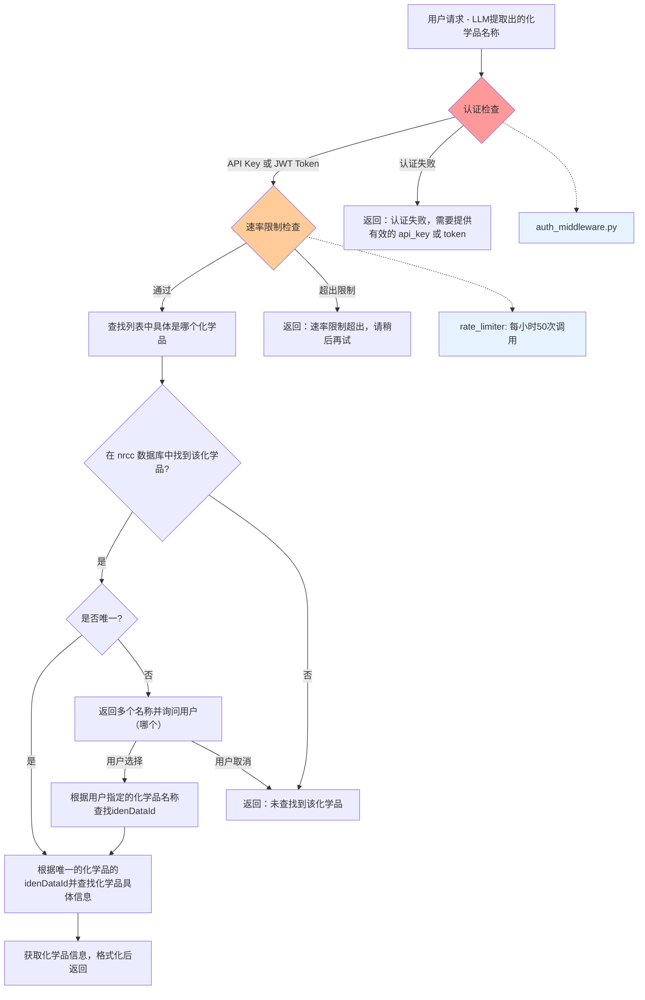

```mermaid
graph TD;
    A["用户请求 - LLM提取出的化学品名称"] --> B{"认证检查"};
    B -->|API Key 或 JWT Token| C{"速率限制检查"};
    C -->|通过| D["查找列表中具体是哪个化学品"];
    C -->|超出限制| E["返回：速率限制超出，请稍后再试"];
    B -->|认证失败| F["返回：认证失败，需要提供有效的 api_key 或 token"];

    D --> G{"在 nrcc 数据库中找到该化学品?"};
    G -->|是| H{"是否唯一?"};
    H -->|是| I["根据唯一的化学品的idenDataId并查找化学品具体信息"];
    H -->|否| J["返回多个名称并询问用户（哪个）"];
    G -->|否| K["返回：未查找到该化学品"];

    J -->|用户选择| L["根据用户指定的化学品名称查找idenDataId"];
    J -->|用户取消| K;
    I --> M["获取化学品信息，格式化后返回"];
    L --> I;

    B -.-> N["auth_middleware.py"];
    C -.-> O["rate_limiter: 每小时50次调用"];

    style B fill:#ff9999
    style C fill:#ffcc99
    style N fill:#e6f3ff
    style O fill:#e6f3ff
```