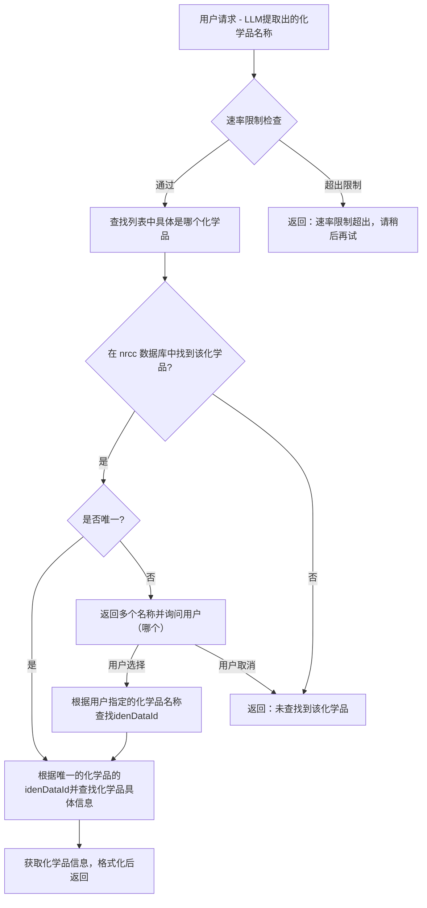

```mermaid
graph TD;
    A["用户请求 - LLM提取出的化学品名称"] --> B{"速率限制检查"};
    B -->|通过| C["查找列表中具体是哪个化学品"];
    B -->|超出限制| D["返回：速率限制超出，请稍后再试"];

    C --> E{"在 nrcc 数据库中找到该化学品?"};
    E -->|是| F{"是否唯一?"};
    F -->|是| G["根据唯一的化学品的idenDataId并查找化学品具体信息"];
    F -->|否| H["返回多个名称并询问用户（哪个）"];
    E -->|否| I["返回：未查找到该化学品"];

    H -->|用户选择| J["根据用户指定的化学品名称查找idenDataId"];
    H -->|用户取消| I;
    G --> K["获取化学品信息，格式化后返回"];
    J --> G;
```